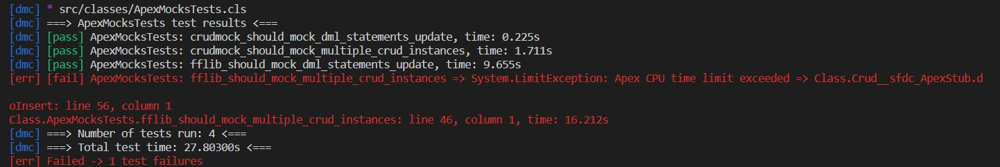

# ApexMocks Testing Library: The Repository Pattern

Hello! If you've arrived here via [The Repository Pattern](https://www.jamessimone.net/blog/joys-of-apex/repository-pattern/), you'll note that the Readme is slightly different from the Master branch of this repository. At its core, the Apex Mocks library uses 3 basic concepts to supercharge your Apex test results and empower you to easily do true unit testing within Apex:

- the use of IoC / Dependency Injection via the [Factory Pattern](https://www.jamessimone.net/blog/joys-of-apex/dependency-injection-factory-pattern)
- the use of [DML (data manipulation language) mocking](https://www.jamessimone.net/blog/joys-of-apex/mocking-dml) for SObject creation / updating / upserting / deleting / undeleting
- the use of the Repository Pattern to replace raw SOQL in your Salesforce.com code

This repository also contains the FFLib library classes in order to perform the stress tests I've detailed below, which can make scrolling through the class list a bit tedious. The relevant classes that you'll want to look at in this branch I've listed below:

- Factory
- IRepository
- Repository
- Repository_Tests
- Query
- Query_Tests
- RepoFactory
- RepoFactoryMocks

Thanks for visting and perusing the code. Without further ado, the primary (Master branch) introduction to the Apex Mocks library is presented below:

## Introduction

FFLib was [publicized with some fanfare way back in 2014](https://code4cloud.wordpress.com/2014/05/09/simple-dependency-injection/):

> This approach even allows us to write DML free tests that never even touch the database, and consequently execute very quickly!

But is this claim ... true?

It was suggested on Reddit following the publication of my second blog post on [The Joys Of Apex](https://jamessimone.net/blog/the-joys-of-apex) that I was "[doing it wrong](https://www.reddit.com/r/salesforce/comments/egrw71/the_joys_of_apex_mocking_dml_operations/)." I thought a lot about what [u/moose04](https://www.reddit.com/user/moose04/) was saying - perhaps it had been premature of me to dismiss what I saw as the same "creep spread" and Java boilerplate that I wasn't crazy about when I considered the merits of the built-in Salesforce stubbing methods. To be clear - it's still possible for that to be the case. That said, Salesforce is a platform that (I believe) thrives on the ability for developers to quickly test and iterate through theories. Why not use the very same platform we were discussing to stress test my implementation against the FFLib library?

## My methodology

1. Create a new salesforce instance ... I just [signed up](https://developer.salesforce.com/signup) for one and got my security token emailed to me.
2. Git cloned [fflib-apexmocks](https://github.com/apex-enterprise-patterns/fflib-apex-mocks).
3. Clean up all the junk - I just took the latest version of their classes and deleted the rest.
4. Added `Crud`, `Crud_Tests`, `CrudMock`, `CrudMock_Tests`, `ICrud`, `TypeUtils`, and `TestingUtils` from my private repo for testing.
5. Wrote some stress tests in `ApexMocksTests`.
6. Run `cp .envexample .env` and fill out your login data there.
7. Deployed it all using `yarn deploy` (you can toggle tests running using the RUN_TESTS flag in your .env file).
8. Ran the tests.

## Result

I wasn't sure what to expect when writing the stress tests. I wanted to choose deliberately long-running operations to simulate what somebody could expect for:

- CPU intensive transactions, particularly those involving complicated calculations
- Batch processes / queueable tasks which process large numbers of records (which I would hazard to say is a fairly common use-case in the SFDC ecosystem).

Here's what I found (note - I ran the tests ten times before taking this screenshot):

(Run 1 was off my console, here's the other results ...)

Run 2 (with LARGE_NUMBER set to 1 million):

| Library  | Test                                       | Test Time                           |
| -------- | ------------------------------------------ | ----------------------------------- |
| CrudMock | crudmock_should_mock_dml_statements_update | 2.069s                              |
| fflib    | fflib_should_mock_dml_statements_update    | System.LimitException after 37.036s |

Run 3 (with LARGE_NUMBER set to 1 million):

| Library  | Test                                       | Test Time                          |
| -------- | ------------------------------------------ | ---------------------------------- |
| CrudMock | crudmock_should_mock_dml_statements_update | 1.955s                             |
| fflib    | fflib_should_mock_dml_statements_update    | System.LimitException after 38.21s |

Run 4 (with LARGE_NUMBER set to 100,000):

| Library  | Test                                       | Test Time |
| -------- | ------------------------------------------ | --------- |
| CrudMock | crudmock_should_mock_dml_statements_update | 0.295s    |
| fflib    | fflib_should_mock_dml_statements_update    | 9.585s    |

Run 5 (with LARGE_NUMBER set to 100,000):

| Library  | Test                                       | Test Time |
| -------- | ------------------------------------------ | --------- |
| CrudMock | crudmock_should_mock_dml_statements_update | 0.208s    |
| fflib    | fflib_should_mock_dml_statements_update    | 9.655s    |

Run 6 (with LARGE_NUMBER set to 100,000):

| Library  | Test                                       | Test Time |
| -------- | ------------------------------------------ | --------- |
| CrudMock | crudmock_should_mock_dml_statements_update | 1.835s    |
| fflib    | fflib_should_mock_dml_statements_update    | 16.639s   |

Run 7 (with LARGE_NUMBER set to 1 million):

| Library  | Test                                       | Test Time                        |
| -------- | ------------------------------------------ | -------------------------------- |
| CrudMock | crudmock_should_mock_dml_statements_update | 5.703s                           |
| fflib    | fflib_should_mock_dml_statements_update    | System.LimitException at 20.543s |

Run 8 (with LARGE_NUMBER set to 100,000):

| Library  | Test                                       | Test Time |
| -------- | ------------------------------------------ | --------- |
| CrudMock | crudmock_should_mock_dml_statements_update | 1.823s    |
| fflib    | fflib_should_mock_dml_statements_update    | 16.694s   |

Run 9 (with LARGE_NUMBER set to 100,000):

| Library  | Test                                         | Test Time                           |
| -------- | -------------------------------------------- | ----------------------------------- |
| CrudMock | crudmock_should_mock_dml_statements_update   | 1.796s                              |
| fflib    | fflib_should_mock_dml_statements_update      | System.LimitException after 15.994s |
| CrudMock | crudmock_should_mock_multiple_crud_instances | 14.206s                             |
| fflib    | fflib_should_mock_multiple_crud_instances    | 18.292s (passed, somehow)           |

Run 10 (LARGE_NUMBER set to 100,000):

| Library  | Test                                         | Test Time                           |
| -------- | -------------------------------------------- | ----------------------------------- |
| CrudMock | crudmock_should_mock_dml_statements_update   | .225s                               |
| fflib    | fflib_should_mock_dml_statements_update      | 9.655s                              |
| CrudMock | crudmock_should_mock_multiple_crud_instances | 1.711s                              |
| fflib    | fflib_should_mock_multiple_crud_instances    | System.LimitException after 16.212s |

Seasoned testing vets will note that there is some "burn-in" when testing on the SFDC platform; similar to the SSMS's optimizer, Apex tends to optimize over time. One of the first times I ran the first two tests, `crudmock_should_mock_dml_statements` and `fflib_should_mock_dml_statements`, the fflib test failed after 38 seconds and the CrudMock test passed in 1.955s).

The only time I successfully observed the CrudMock singleton test failing was when the value for `LARGE_NUMBER` was bumped up to 1 million (and, to be fair, it also ran several times successfully at that load).

Of course, it isn't reasonable to expect that these tests are exactly mirroring testing conditions. What is reasonable to expect is that the more complicated your test setup, the longer things are going to take using the FFLib library. The reason for that is simple - their mocks / stubs utilize deep call stacks:

- handleMethodCall
- mockNonVoidMethod
- recordMethod
- recordMethod again (overloaded)

That's just for an absurdly simple mocking setup, mocking one method. Again, the more you need to utilize mocking in your tests (particularly if you are testing objects passing through multiple handlers / triggers), the greater the overhead of the library on influencing your overall test time will be.

Thanks!
